<!-- file: architecture.md v1.0 -->
# MySphere fakesite — Architecture & Logic Flow

## Install Pipeline Overview

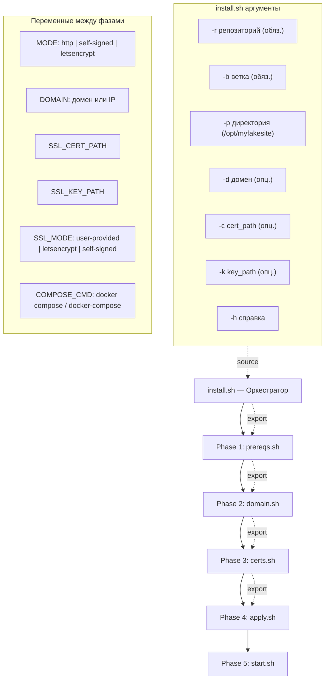

## Phase 1 — Prerequisites

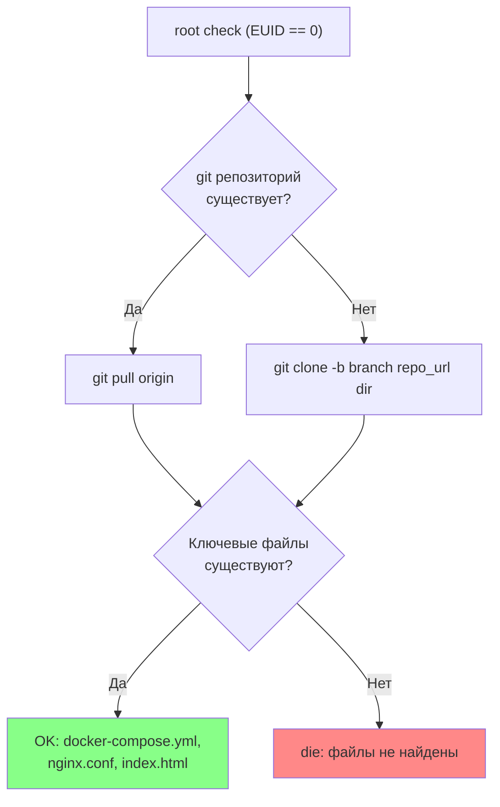

## Phase 2 — Domain & Ports

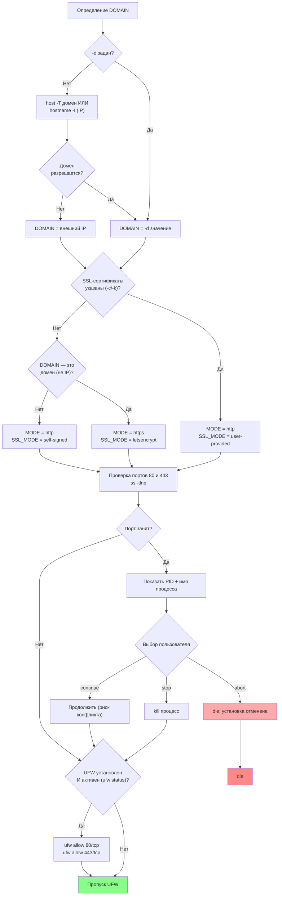

## Phase 3 — Certificates

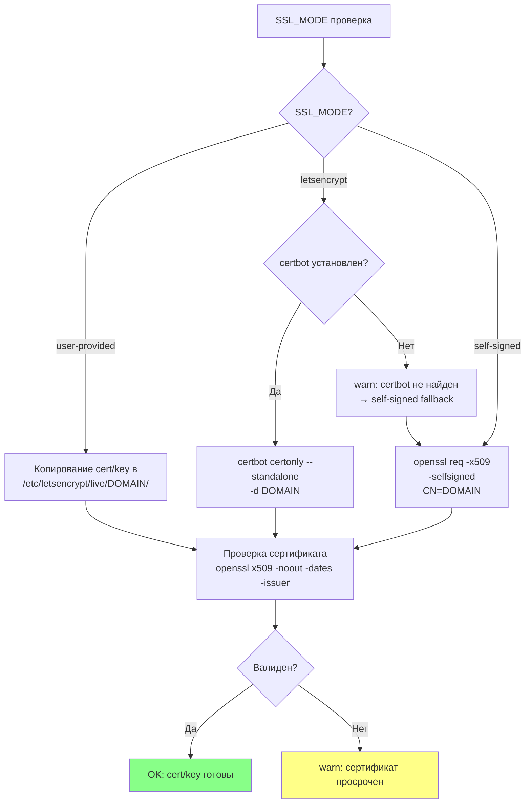

## Phase 4 — Apply Configuration

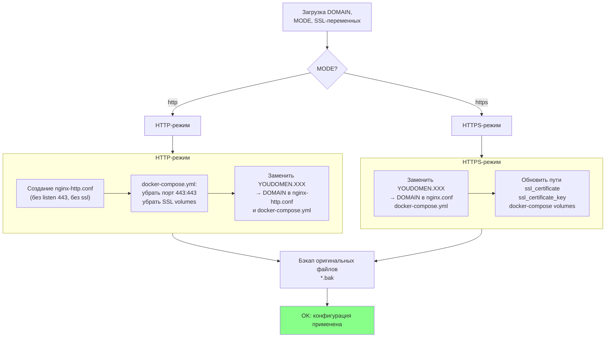

## Phase 5 — Start & Verify

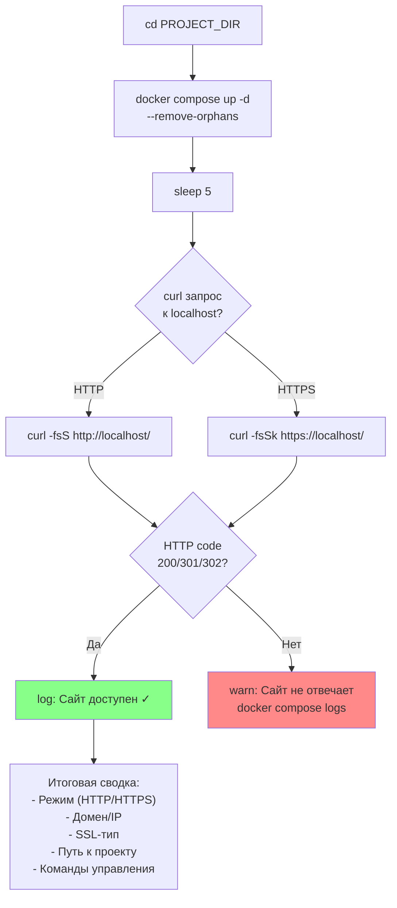

## Update Pipeline

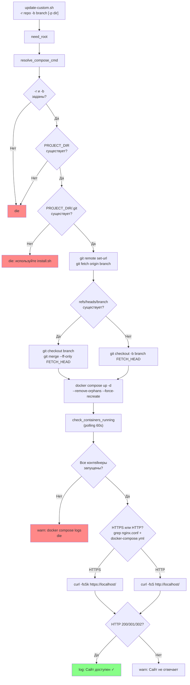

## Delete Pipeline

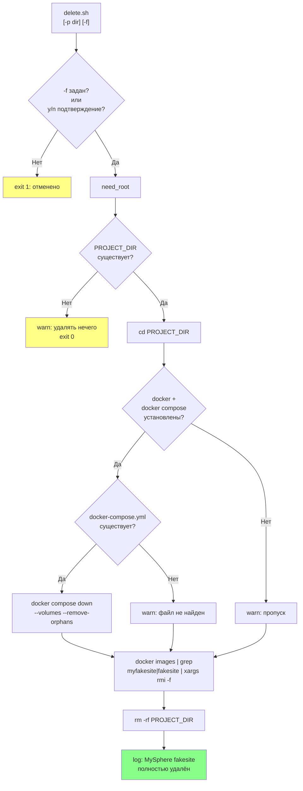

## Complete Project Structure

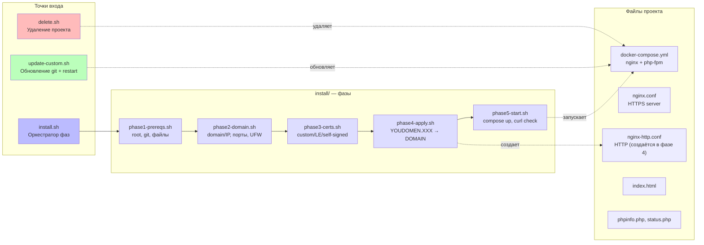

## Режимы работы (MODE)

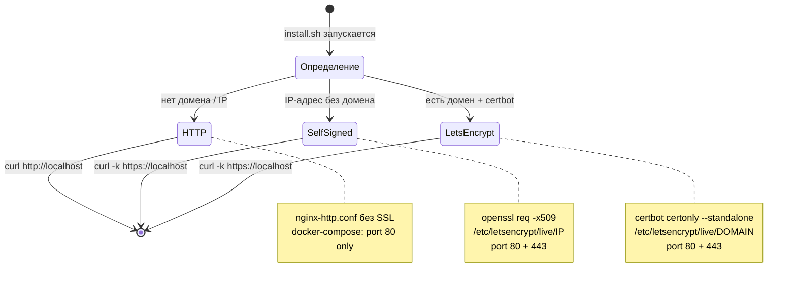

## Переменные между фазами (export chain)

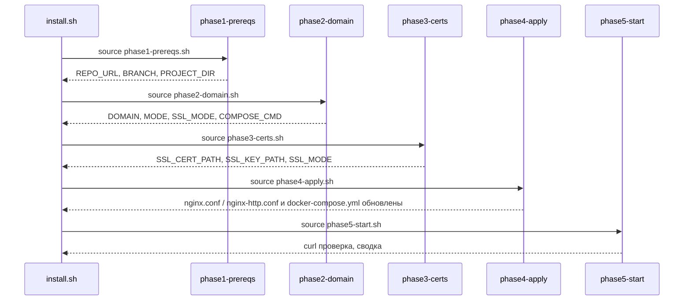
