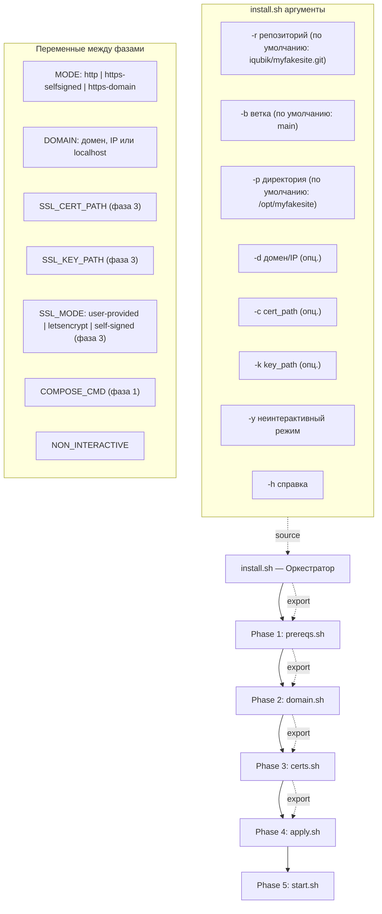
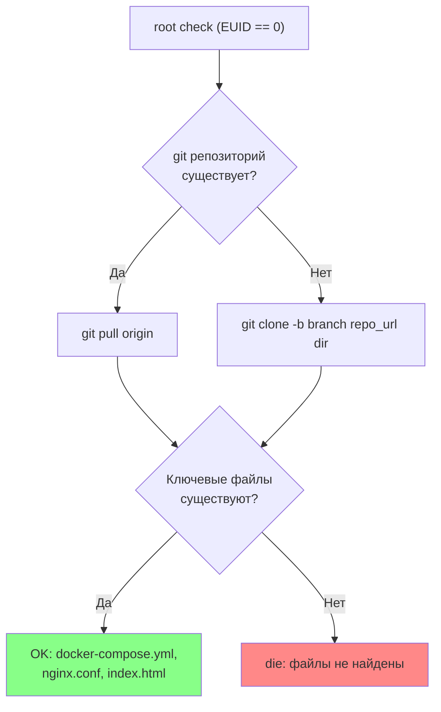
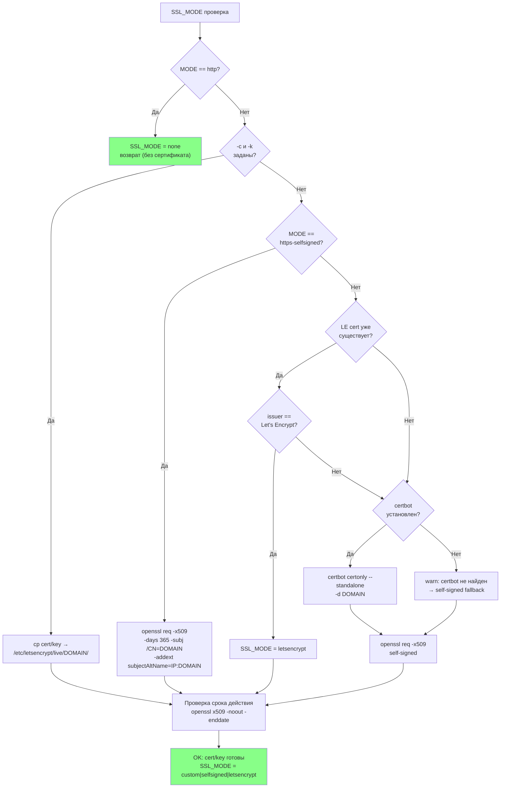
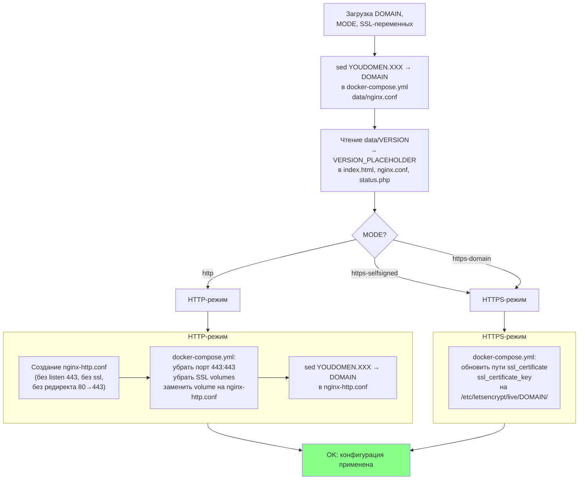
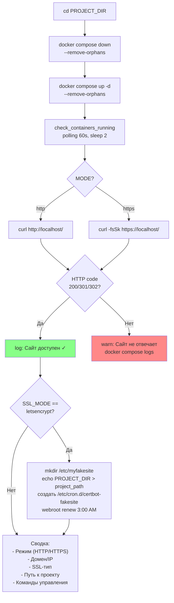
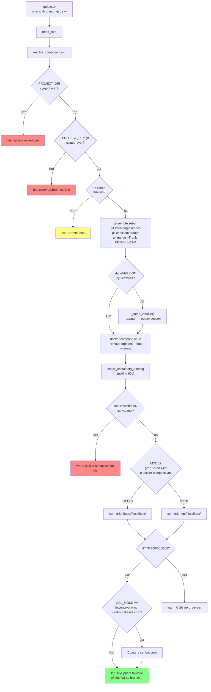
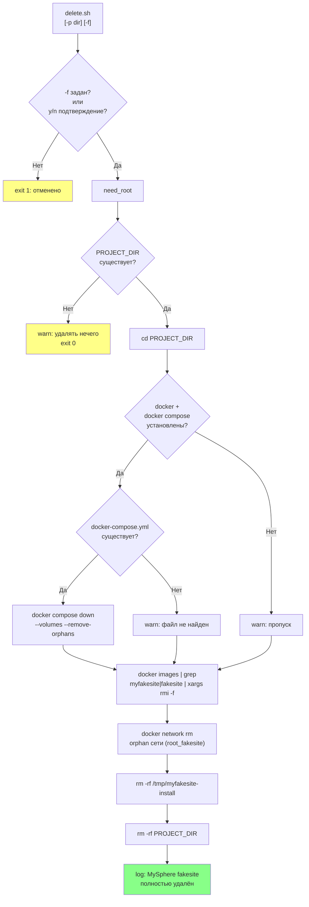
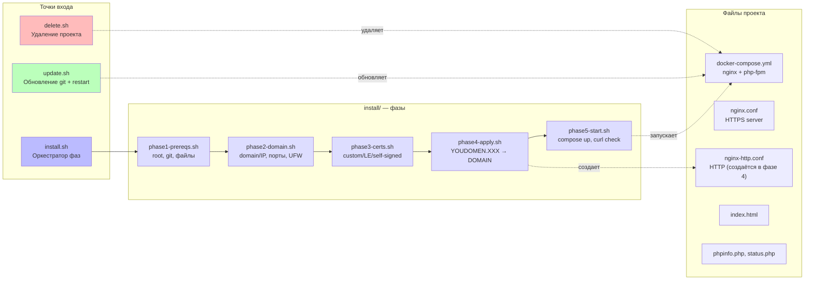
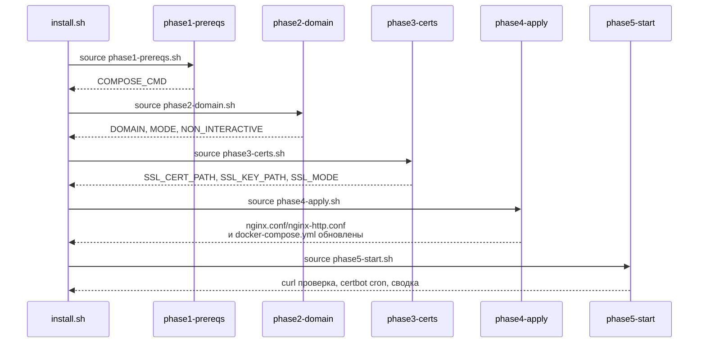

<!-- file: architecture.md v1.0 -->
# MySphere fakesite — Architecture & Logic Flow

## Install Pipeline Overview



## Phase 1 — Prerequisites



## Phase 2 — Domain & Ports

```mermaid
flowchart TD
  Start2["Определение DOMAIN"] --> ArgCheck{"-d задан?"}

  ArgCheck -->|Да| UseDomain["DOMAIN = -d значение"]
  ArgCheck -->|Нет| NonInt{"NON_INTERACTIVE\ntrue?"}

  NonInt -->|Да| DefaultLocal["DOMAIN = localhost"]
  NonInt -->|Нет| Prompt["read DOMAIN < /dev/tty\nили stdin если -t 0"]

  Prompt --> EnteredEmpty{"DOMAIN\nпустой?"}
  EnteredEmpty -->|Да| DefaultLocal
  EnteredEmpty -->|Нет| UseDomain

  UseDomain --> ModeCheck
  DefaultLocal --> SetHttp["MODE = http"]

  ModeCheck{"DOMAIN тип?"} -->|localhost| SetHttp
  ModeCheck -->|IP (x.x.x.x)| SetSS["MODE = https-selfsigned"]
  ModeCheck -->|домен| SetLE["MODE = https-domain"]

  SetHttp --> PortCheck
  SetSS --> PortCheck
  SetLE --> PortCheck

  PortCheck["Проверка портов 80 и 443\nss -tlnp"] --> PortBusy{"Порт занят?"}

  PortBusy -->|Да| ShowProc["Показать PID + имя процесса"]
  ShowProc --> UserChoice{"Выбор пользователя\n(-y = abort)"}

  UserChoice -->|stop| StopProc["kill процесс"]
  UserChoice -->|continue| Cont["Продолжить (риск конфликта)"]
  UserChoice -->|abort| Abort["die: установка отменена"]

  StopProc --> UFWCheck
  Cont --> UFWCheck
  Abort --> Die2["die"]

  PortBusy -->|Нет| UFWCheck

  UFWCheck{"UFW установлен\nИ активен (ufw status)?"} -->|Да| UFWOpen["ufw allow 80/tcp\nufw allow 443/tcp"]
  UFWCheck -->|Нет| Done2["Пропуск UFW"]

  UFWOpen --> Done2

  style Die2 fill:#f88
  style Done2 fill:#8f8
  style Abort fill:#faa
```

## Phase 3 — Certificates



## Phase 4 — Apply Configuration



## Phase 5 — Start & Verify



## Update Pipeline



## Delete Pipeline



## Complete Project Structure



## Режимы работы (MODE)

```mermaid
stateDiagram-v2
  [*] --> Определение: install.sh запускается
  Определение --> HTTP: DOMAIN пустой/localhost или -y
  Определение --> SelfSigned: IP-адрес (-d 77.110.125.196)
  Определение --> Domain: домен (-d example.com)

  HTTP --> [*]: curl http://localhost
  SelfSigned --> SelfSignedGen["openssl req -x509\nCN=IP"]
  SelfSignedGen --> [*]: curl -k https://IP
  Domain --> LECheck{"LE cert\nсуществует?"}
  LECheck -->|Да| [*]: curl https://domain
  LECheck -->|Нет| Certbot["certbot certonly\n--standalone"]
  Certbot --> [*]: curl https://domain

  note right of HTTP
    MODE = http
    nginx-http.conf без SSL
    docker-compose: port 80 only
  end note

  note right of SelfSigned
    MODE = https-selfsigned
    openssl req -x509 -days 365
    /etc/letsencrypt/live/IP
    subjectAltName=IP:IP
    port 80 + 443
  end note

  note right of Domain
    MODE = https-domain
    certbot или existing LE cert
    /etc/letsencrypt/live/DOMAIN
    port 80 + 443
  end note
```

## Переменные между фазами (export chain)


