# MySphere — Application Logic

## Request Routing Architecture

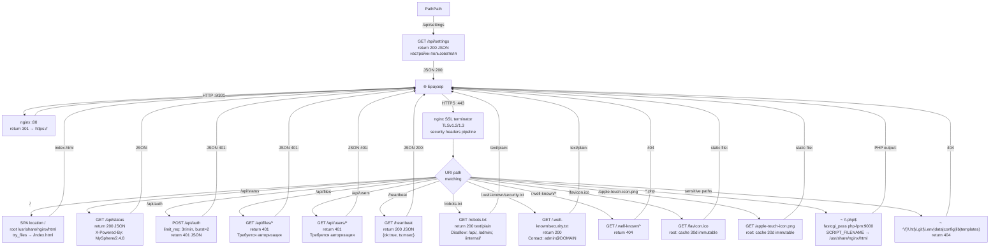

## API Endpoints — Mock Responses

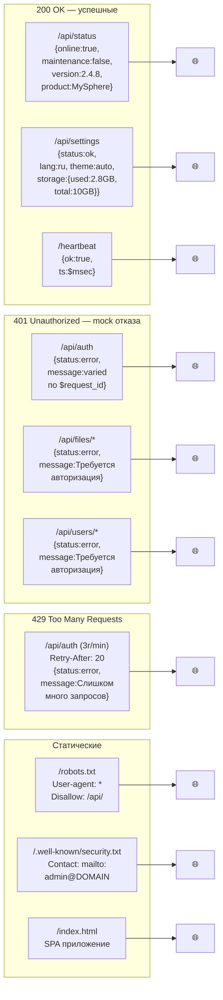

## Auth Error Variation (по $request_id)

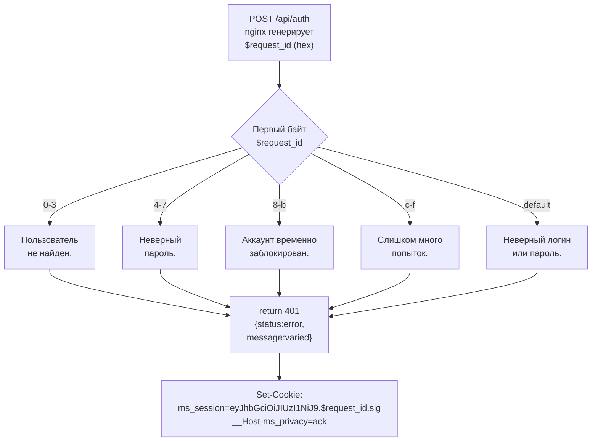

## Rate Limiting — State Machine

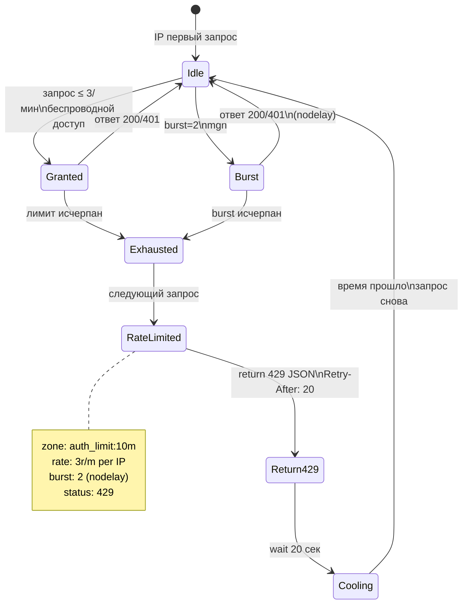

## Security Headers Pipeline

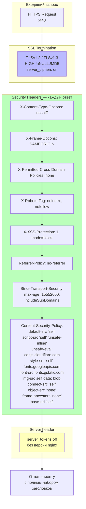

## Docker Container Topology

```mermaid
flowchart TB
  subgraph HOST [Linux Host]
    subgraph NETWORK [Docker Network: fakesite (bridge)]
      subgraph NGINX_CONTAINER [fakesite (nginx:alpine)]
        N1["nginx:80, :443"]
        N2["ports:\n80:80\n443:443"]
        N3["limits:\nCPU: 0.25\nRAM: 64M"]
      end

      subgraph PHP_CONTAINER [fakesite-php (php:8.3-fpm-alpine)]
        P1["php-fpm:9000"]
        P2["no exposed ports\nonly internal network"]
        P3["limits:\nCPU: 0.1\nRAM: 32M"]
      end

      N1 -->|"fastcgi_pass\nphp-fpm:9000"| P1
    end

    subgraph VOLUMES [Bind Mounts]
      V1["./index.html → /usr/share/nginx/html/index.html :ro"]
      V2["./nginx.conf → /etc/nginx/conf.d/default.conf :ro"]
      V3["./status.php → /usr/share/nginx/html/status.php :ro"]
      V4["./phpinfo.php → /usr/share/nginx/html/phpinfo.php :ro"]
      V5["./favicon.ico → ... :ro"]
      V6["./apple-touch-icon.png → ... :ro"]
      V7["./robots.txt → ... :ro"]
      V8["SSL cert → /etc/nginx/certs/fakesite.crt :ro"]
      V9["SSL key → /etc/nginx/certs/fakesite.key :ro"]
      V10["status.php → php-fpm :ro"]
      V11["phpinfo.php → php-fpm :ro"]
    end

    subgraph CERTS [SSL Certificates]
      C1["/etc/letsencrypt/live/DOMAIN/\nfullchain.pem + privkey.pem\nили self-signed"]
    end
  end

  Internet -->|"HTTP 80\nHTTPS 443"| N2
  C1 -. mount .-> V8
  C1 -. mount .-> V9
  VOLUMES -. volumes .-> NGINX_CONTAINER
  VOLUMES -. volumes .-> PHP_CONTAINER

  style NGINX_CONTAINER fill:#bfb
  style PHP_CONTAINER fill:#bbf
  style VOLUMES fill:#ffb
  style CERTS fill:#fbb
```

## Frontend — SPA Application Flow

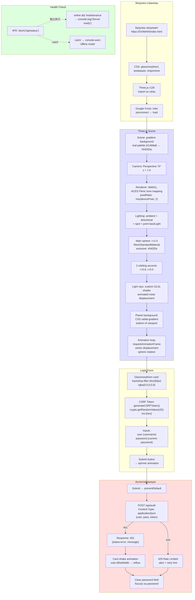

## Three.js Rendering Pipeline

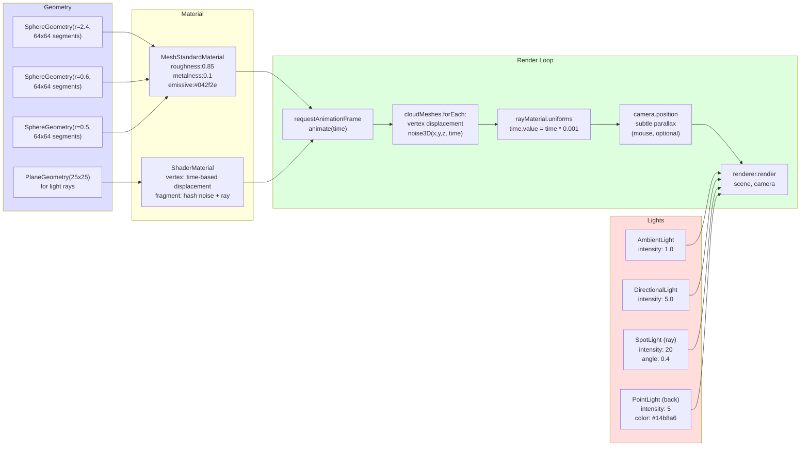

## SPA Routing — try_files Logic

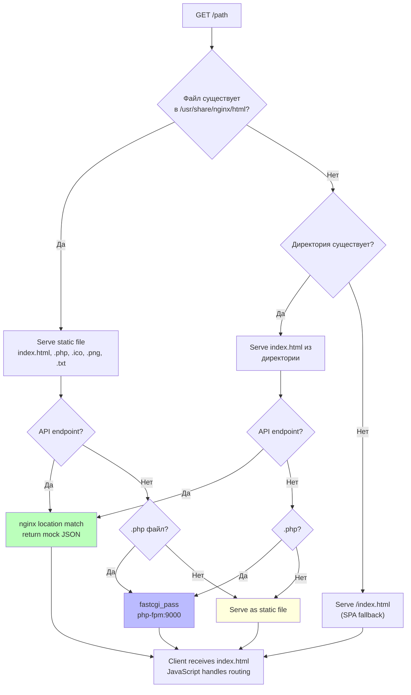

## Health & Maintenance — PHP vs Mock

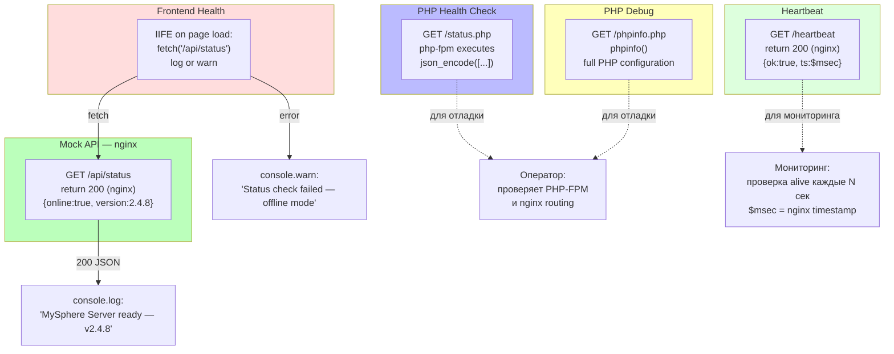

## CSS & Visual Design System

```mermaid
flowchart TD
  subgraph PALETTE [Color Palette]
    C1["#14b8a6 — Teal 500\n(accent, light)"]
    C2["#0d9488 — Teal 600\n(primary)"]
    C3["#0f766e — Teal 700\n(body background)"]
    C4["#042f2e — Teal 950\n(deepest, planet)"]
    C5["#ffffff — White\n(text, borders)"]
    C6["rgba(0,0,0,0.8) — Black glass\n(card backgrounds)"]
  end

  subgraph GLASS [Glassmorphism]
    G1["background: rgba(0,0,0,0.8)\nbackdrop-filter: blur(60px)\nsaturate(120%)"]
    G2["border: 1px solid rgba(255,255,255,0.1)\nborder-radius: 0.5rem\nbox-shadow: 0 8px 32px rgba(0,0,0,0.8)"]
    G3["inputs: rgba(0,0,0,0.85)\nfocus: rgba(0,0,0,0.95)"]
  end

  subgraph ANIMATIONS [Animations]
    A1["@keyframes fadeUp\nopacity 0→1, translateY 20→0\nduration: 0.8s cubic-bezier"]
    A2["@keyframes fadeIn\nopacity 0→1\nduration: 1s ease-out"]
    A3["@keyframes spin\nrotate 0→360°\n1s linear infinite"]
    A4["@keyframes shake\ntranslateX ±4px\n0.4s — error feedback"]
  end

  subgraph PLANET [Planet Background]
    P1["CSS radial-gradient\nbottom: -135vh, left: 50%\nwidth: 250vw, height: 150vh"]
    P2["border-radius: 50%\nbox-shadow: teal glow\nborder-top: 2px rgba(white,0.3)"]
    P3["z-index: 1\npointer-events: none"]
  end

  PALETTE --> GLASS
  GLASS --> ANIMATIONS
  ANIMATIONS --> PLANET
  PLANET --> Canvas["Three.js canvas\nz-index: 0"]
  Canvas --> Login["Login overlay\nz-index: 10\npointer-events: auto"]
  Login --> Footer["Footer bar\nz-index: 20\nversion + branding"]

  style PALETTE fill:#ddf
  style GLASS fill:#ffd
  style ANIMATIONS fill:#dfd
  style PLANET fill:#fdd
```

## Complete Request-Response Lifecycle

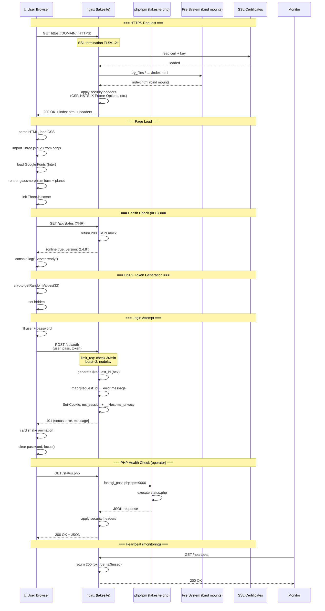

## Resource Limits & Container Constraints

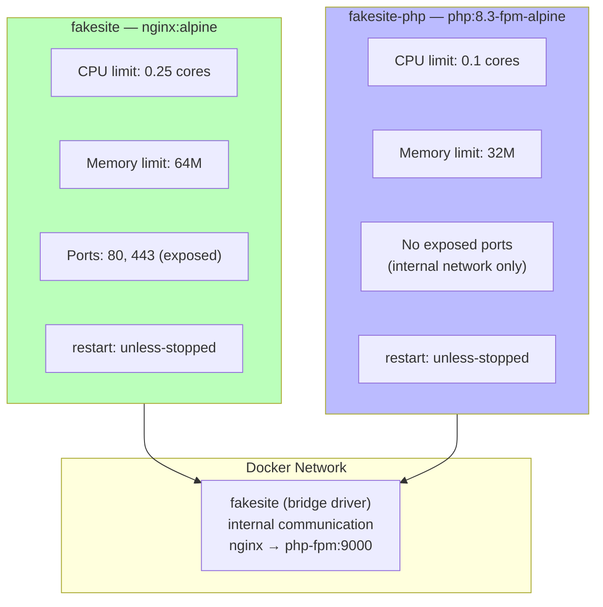

## File Mount Map — What Goes Where

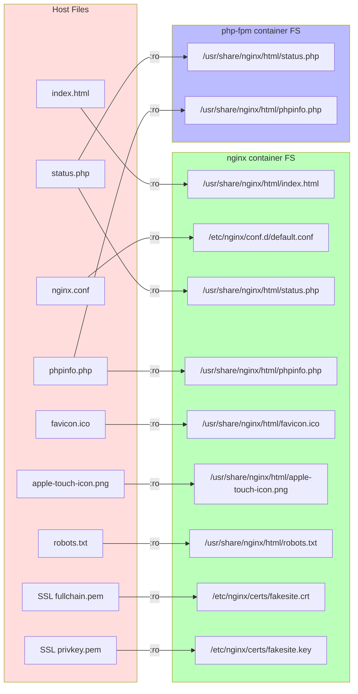
